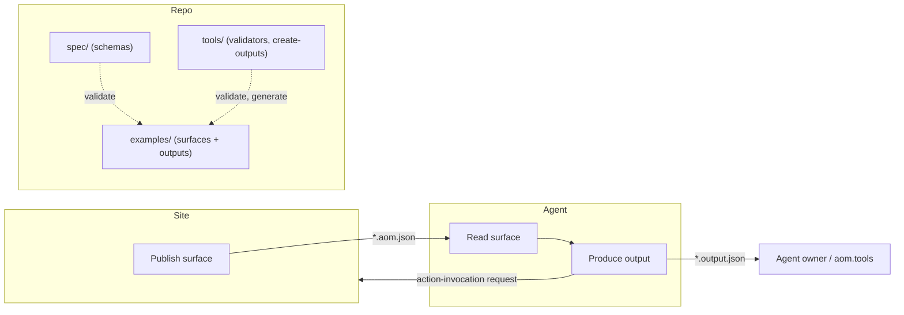

# AOM Specification

This directory contains the complete JSON Schema definitions for the Agent Object Model (AOM)™ protocol. **To validate surfaces and outputs**, use the [CLI](../../README.md#quick-start) from the repo root (`aom.py` / `aom.mjs`).

## Schemas

### `aom-input-schema.json` (core surface schema)

**What it defines**: The structure of an AOM **surface** (screen, modal, panel, widget, drawer).

**Validates**: `*.aom.json` files in `examples/` (for example `examples/v0.1.0/`)

**Key sections**:
- `automation_policy` — (Required) Agent automation policy for a surface: `forbidden` \| `allowed` \| `open`. Conceptually:
  - `forbidden` — No automation; agents may read only enough AOM/policy to learn this rule, then MUST stop using this surface.
  - `allowed` — **READY / guardrailed mode**; agents MUST treat the AOM as the only source of truth for actions and MUST NOT act based on DOM/HTML or other page content outside the AOM.
  - `open` — Permissive mode; agents MAY go beyond the AOM’s explicit actions, using additional page content to infer reasonable actions (while still obeying global safety rules).
- `generated_at` — (Required) ISO 8601 timestamp when this AOM document was generated.
- `calling_agent` — (Optional) Identifies the agent requesting this surface and/or declares that when the agent submits a request on this site it must include `agent_id` (and optionally `agent_name`) in that request; standard field names are `agent_id` and `agent_name`. See [Agent identity and traceability](#agent-identity-and-traceability).
- `purpose` — Primary goal and user roles
- `tasks` — Explicit tasks the surface supports, including `default_action_id`, `success_conditions` (min one)
- `entities` — Domain objects with schema (including `validation`), and current values
- `actions` — Operations agents can perform, including `priority` ranking and `method`
- `state` — Session and workflow state, including `flow_id` tracking
- `navigation` — Breadcrumbs and neighbor surfaces
- `signals` — Errors, warnings, notifications, and automated `test_cases`

**Use when**: Generating or consuming AOM from web/mobile screens.

### `aom-output-schema.json` (agent output schema)

**What it defines**: The structure of an **agent's response** to an AOM surface.

**Validates**: `*.output.json` files in **Examples/** or **examples/** (typically under each surface’s **outputs/** folder).

**Key sections**:
- `agent_id` — (Optional) Identifier of the agent producing this output. When the surface declares `calling_agent.agent_id_required`, the agent MUST include this in the output and in the action-invocation request to the site for traceability.
- `agent_name` — (Optional) Human-readable name of the agent; include when the surface requires it or for logging (e.g. aom.tools).
- `key_issuer` — (Optional) Issuer of `agent_id` (e.g. 'aom.tools').
- `mode` — `"single"` (one-shot) or `"flow"` (multi-step)
- `thought` — Agent's reasoning (for debugging/transparency)
- `action` — Requested action with `action_id` + `params`
- `result` — Final output (populated when `meta.done: true`)
- `meta` — Control flags including `done`, `error`, `confidence`, and optional `a2h_intent`

**Use when**: Building agents that operate on AOM surfaces.

**Secure/signed payloads** are out of scope for this spec; any standard for signed envelopes or verification will be defined elsewhere.

## AOM Contracts

AOM defines **two** machine-readable contracts. Both are required for AOM-compliant agent systems:

| Contract    | Schema                     | File Extension   | Purpose                                                               |
|-------------|----------------------------|-----------------|-----------------------------------------------------------------------|
| **Surface** | `aom-input-schema.json`    | `*.aom.json`    | Describes what the agent sees (UI state, available actions, entities) |
| **Output**  | `aom-output-schema.json`   | `*.output.json` | Describes what the agent does (thought, action, result, confidence)   |

### Where the documents fit

The diagram below shows how surfaces (input) and outputs are produced and consumed, and where the files in this repo live.



- **Site** publishes an AOM surface (input) per page or component. The agent receives this as `*.aom.json` (or equivalent JSON).
- **Agent** reads the surface, decides an action, and produces an **output** (`*.output.json`). The full output is for the agent owner (and e.g. logging at aom.tools). When the agent invokes an action, it sends an **action-invocation request** (action_id, params, and optionally agent_id, agent_name) to the site.
- **This repo**: `spec/v0.1.0/` holds the schemas; `examples/v0.1.0/` holds sample surfaces and golden outputs; `tools/` holds validators and `create-outputs` to generate outputs from surfaces. Use the schemas to validate your own `*.aom.json` and `*.output.json` files.

## Versioning

Both schemas use semantic versioning:

- **Current version**: `0.1.0` (this document)
- **Breaking changes**: Increment major version (e.g., `1.0.0`)
- **New optional fields**: Increment minor version (e.g., `0.2.0`)
- **Clarifications/fixes**: Increment patch version (e.g., `0.1.1`)

Each AOM surface must declare its version:

```json
{
  "aom_version": "0.1.0",
  ...
}
```

---

## Key principles (quick)

These mirror the design intent throughout the spec:

1. **Task-centric** — organized around user goals, not UI layout.
2. **Entity-driven** — data structures are explicit and typed.
3. **Action-oriented** — what the agent can do is enumerated and validated.
4. **State-aware** — workflows and session context can be represented explicitly.
5. **Layout-free** — no CSS, coordinates, or presentation noise.
6. **Semantic-only** — meaning first; avoid DOM coupling.
7. **Automation guardrails** — `forbidden` / `allowed` / `open` control how agents may use the surface.

## Agent identity and traceability

Agent identity (**agent_id**, **agent_name**) lives in the **output** and in the **request** the agent sends to the site when invoking an action. The **input** (surface) does not contain the agent's identity; it may **declare** that when the agent submits a request on this site it must include `agent_id` (and optionally `agent_name`) in that request.

- **Output schema**: Top-level `agent_id`, optional `agent_name`, optional `key_issuer`. The agent fills these when producing an output; the same values are sent in the action-invocation request to the site.
- **Input schema**: Optional `calling_agent` can identify the agent requesting the surface and/or declare requirements (`agent_id_required`, `agent_name_required`). Standard field names in the request are **agent_id** and **agent_name**.
- **Action-invocation request**: When the agent invokes an action, the payload to the site SHOULD include top-level `agent_id` and optionally `agent_name` (same as in the output). Site owners MAY log them for traceability. Optional today; as the ecosystem matures, surfaces may require them.
- **Logging**: The full output is for the agent owner (and e.g. aom.tools); the site does not receive the full output. The site receives only the action-invocation request (action_id, params, and optionally agent_id, agent_name).

## Design Principles

### 1. Task-Centric, Not DOM-Centric

AOM describes **what users can accomplish** (tasks, actions, entities), not the HTML structure.

**Why**: Agents reason about goals, not CSS selectors.

### 2. Entity-Driven

Domain objects (Product, Order, User) are first-class citizens with schemas, runtime validations, and current values.

**Why**: Agents operate on structured data, not unstructured text.

### 3. Declarative Actions

Actions declare their inputs, outputs, effects, priorities, and preconditions.

**Why**: Agents can plan, validate, and execute actions safely.

### 4. Production Intelligence

AOM natively supports automated testing via `signals.test_cases` and runtime escalation gating via `meta.confidence`.

**Why**: Agents require strict validation and human-in-the-loop fallback paths for enterprise reliability.

### 5. Mode Flexibility

Supports both single-shot (one action → done) and flow (multi-step workflows).

**Why**: Different tasks have different execution patterns.

### 6. Runtime-Agnostic

AOM is JSON. Works with any agent framework, LLM, or automation tool.

**Why**: Interoperability across ecosystems.

## JSON Schema Details

Both schemas use **JSON Schema Draft 2020-12**:

- `$schema: "https://json-schema.org/draft/2020-12/schema"`
- Full validation support via `ajv` (Node) or `jsonschema` (Python)

### Required vs Optional Fields

**Input/core schema** (`aom-input-schema.json`):
- **Required**: `automation_policy`, `aom_version`, `surface_id`, `surface_kind`, `generated_at`, `purpose`, `context`, `tasks`, `entities`, `actions`, `state`, `navigation`, `signals`
- **Optional**: `generator`, `calling_agent`, `a2h`

**Output schema** (`aom-output-schema.json`):
- **Required**: `mode`, `action` (with `action_id`), `meta` (with `done` and `confidence`)
- **Optional**: `agent_id`, `step_id`, `thought`, `result`

---

## Extending AOM

### Custom Fields

Both schemas allow `additionalProperties: true` in specific sections:

- `context` — Add app-specific metadata
- `state` — Add custom flags/values
- `navigation` — Add extra routing info
- `signals` — Add structured error objects

**Example**:

```json
{
  "context": {
    "app_name": "MyApp",
    "locale": "en-US",
    "custom_tenant_id": "acme-corp",
    "custom_feature_flags": ["beta_ui", "dark_mode"]
  }
}
```

### Custom Entity Types

Entity schemas support arbitrary field types and custom validation rules:

```json
{
  "entities": {
    "CustomWidget": {
      "schema": {
        "widget_id": {"type": "string", "required": true},
        "config": {"type": "object", "required": false}
      },
      "current": {
        "widget_id": "w123",
        "config": {"color": "blue", "size": "large"}
      }
    }
  }
}
```

---

## Optional: `binds_to` (agents.json Integration)

Actions can optionally reference external API/tool definitions via the `binds_to` field:

```json
{
  "actions": [
    {
      "id": "submit_checkout",
      "label": "Place order",
      "category": "mutation",
      "description": "Submit checkout and create order.",
      "input_entities": ["CheckoutIntent"],
      "output_entities": ["OrderConfirmation"],
      "effects": [
        "entities.OrderConfirmation.current = shop_api.place(...)",
        "state.workflow.step_id = 'order_placed'"
      ],
      "binds_to": {
        "type": "agent.workflow_step",
        "ref": "place_order_confirm_checkout",
        "optional": true
      }
    }
  ]
}
```

When to use:

Your runtime has an external tool registry (e.g., agents.json, MCP tools, OpenAPI specs)

You want agents to call real APIs instead of simulating via effects

When binds_to is present:

Runtime tries to resolve binds_to.ref from external registry

If found → use external tool schema (parameters, authentication, etc.)

If not found AND optional: true → fall back to AOM's inline effects

If not found AND optional: false → fail with clear error

Schema:

type (string) — Namespace/type of external binding (e.g., "agent.workflow_step", "mcp.tool", "openapi.operation")

ref (string) — External identifier (tool name, operation ID, etc.)

optional (boolean, default false) — Whether binding is required

Default behavior: If binds_to is omitted, runtime executes action using AOM's effects only.

Roadmap: Auto-resolution from common tool registries.

---

## Optional: A2H (Agent-to-Human) Integration

AOM natively supports the industry-standard A2H protocol for safe Human-in-the-Loop (HITL) escalations. This allows the surface to dictate when an agent must pause and ask a human for approval or data.

### 1. Defining the Policy in the Surface (`aom-core-schema`)
The surface defines which actions require human intervention via the `a2h_policy` object on an action:

```json
{
  "actions": [
    {
      "id": "delete_database",
      "label": "Delete Production DB",
      "category": "mutation",
      "a2h_policy": {
        "requires_authorization": true,
        "escalation_channel": "in_app"
      }
    }
  ]
}
```

### 2. Executing the Intent in the Output (`aom-output-schema`)
When the agent realizes it needs to escalate (either due to the surface's `a2h_policy` or low internal `confidence`), it outputs an `a2h_intent` inside the `meta` block:

```json
{
  "mode": "flow",
  "action": { "action_id": "none" },
  "meta": {
    "done": false,
    "confidence": 0.4,
    "a2h_intent": {
      "type": "AUTHORIZE",
      "message": "I am about to delete the production database. Do I have your approval to proceed?"
    }
  }
}
```

**Supported A2H Intents:**
- `INFORM` — One-way notification to the user.
- `COLLECT` — Request specific structured data from the user.
- `AUTHORIZE` — Request explicit approval for a high-risk action.
- `ESCALATE` — Hand off the entire workflow to a human support agent.
- `RESULT` — Report final task completion.

## Validation tools

tools are organized by language under **tools/** so you can use only Python or only Node. See [tools/README.md](../../tools/README.md).

### Python

```bash
# From repo root (pip install -r tools/python/validate/requirements.txt first)
python tools/python/validate/validate.py spec/v0.1.0/aom-input-schema.json examples/v0.1.0/login-single/login.aom.json
python tools/python/validate/validate_all.py
python tools/python/validate/validate_all.py v0.1.0/ecom-flow
```

### Node

```bash
# From repo root (npm install in tools/node/validate first)
node tools/node/validate/validate.js spec/v0.1.0/aom-input-schema.json examples/v0.1.0/login-single/login.aom.json
node tools/node/validate/validate_all.js
node tools/node/validate/validate_all.js v0.1.0/ecom-flow
```

### Generating output files for testing

Golden `*.output.json` files under each example’s **outputs/** folder are generated by the create-outputs tools. From repo root:

```bash
python tools/python/create-outputs/create_outputs.py
# or
node tools/node/create-outputs/create_outputs.js
```

---

## Schema Changelog

### v0.1.0 (2026-02-26)

**Initial public release (current)**

- Core surface schema with tasks, entities, actions, state, navigation, signals
- Output schema with single/flow modes
- `signals.test_cases` for automated golden-file testing overrides
- `tasks[].default_action_id` to guide primary agent behavior
- `actions[].priority` and `actions[].method` for semantic agent planning
- `entities.*.validation` for runtime data quality checks
- `state.workflow.flow_id` for orchestration context tracking
- Required `meta.confidence` in the output schema for runtime safety gating
- Native support for the A2H (Agent-to-Human) protocol for human-in-the-loop escalations
- Tightened object strictness on output `error` and `workflow` schemas
- Full JSON Schema Draft 2020-12 compliance
- Validator tools ([tools/python/validate](../../tools/python/validate/README.md), [tools/node/validate](../../tools/node/validate/README.md))

### Roadmap: v0.2.0 (not yet released)

Future versions MAY introduce:

- Additional A2H and telemetry fields
- Backward-compatible schema refinements based on real-world usage

---

## FAQ

**Q: Why separate surface and output schemas?**  
A: Surfaces describe *what's available* (input to agent), outputs describe *what the agent decided* (output from agent). Different lifecycles, different consumers.

**Q: Can I use AOM with non-LLM agents?**  
A: Yes. AOM is JSON. Any system that can parse JSON and make decisions can consume AOM.

**Q: Does AOM require specific UI frameworks?**  
A: No. AOM is framework-agnostic. Generate it from React, Vue, mobile apps, or even server-rendered HTML.

**Q: What about authentication/security?**  
A: AOM surfaces can include `state.session.authenticated` and `state.session.user_id`. Authorization logic lives in your runtime, not the schema.

**Q: Can AOM represent native mobile screens?**  
A: Yes. `surface_kind` supports screens, modals, panels, drawers, widgets. The abstraction works for web and mobile.

---

## References

- [JSON Schema 2020-12](https://json-schema.org/draft/2020-12/schema)
- [Schema.org Types](https://schema.org/) (for `entities.*.schema_org_type`)
- [IETF BCP 47 Language Tags](https://www.rfc-editor.org/rfc/bcp/bcp47.txt) (for `context.locale`)

---

## Contributing

Found an issue or have a suggestion?

1. Validate your examples against the schemas first
2. Open an issue with concrete examples
3. Propose changes with before/after JSON snippets

Schema improvements should maintain backward compatibility when possible.