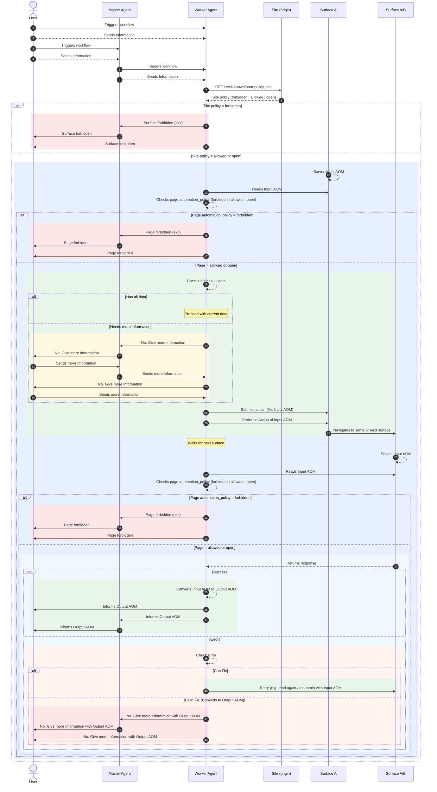

# AOM runtime flow — sequence diagram (for geeks)

This diagram shows the **full runtime flow** including site-level and page-level policy checks, data gathering, action submission, navigation, and success/error handling. Use it when you need the complete picture; the [main spec README](README.md) has a shorter overview.

---

## Diagram

This diagram shows the full path: site and page policy checks, reading surfaces (Input AOM), data checks, action submission, navigation, and success/error handling with Output AOM.

**Note:** After “Can’t fix” or “Needs more information”, the user may send new information; the flow can then re-enter (e.g. Agent reads the surface again or continues from the same page). That loop is implied and not drawn so the diagram stays focused on how **Input AOM** (surfaces) and **Output AOM** (agent responses and escalations) are used.

---

## Section summary

| Section | What it shows |
|--------|----------------|
| **0** | User and Master Agent trigger the Worker Agent and send initial information. |
| **1** | Agent fetches site policy (`/.well-known/aom-policy.json`). If **forbidden**, Agent exits and informs Master and User. If **allowed** or **open**, flow continues. |
| **2** | First surface (Surface A) serves **Input AOM**; Agent reads it and checks the page’s `automation_policy`. If the page is **forbidden**, Agent exits. If **allowed** or **open**, flow continues. |
| **3** | Agent checks if it has all data. If **yes**, it proceeds. If **no**, it requests more information from Master/User until it can proceed. |
| **4** | Agent submits the action (fills **Input AOM**) and performs the action; the site navigates to the same or next surface (e.g. Surface A/B). |
| **5** | Next surface serves Input AOM; Agent reads it and checks page policy again. If **forbidden**, exit. If **allowed** or **open**, surface returns a response. |
| **6** | On **Success**: Agent converts Input AOM to **Output AOM** and informs User and Master. On **Error**: Agent can **fix** (retry with Input AOM) or **can’t fix** (converts to Output AOM and asks Master/User for more information with Output AOM). |

**Note:** After “Can’t fix” (or “Needs more information” in section 3), the user may send new information; the flow can then re-enter (e.g. Agent reads the surface again or continues from the same page). That loop is implied and not drawn here so the diagram stays focused on how **Input AOM** (surfaces) and **Output AOM** (agent responses and escalations) are used.

---

Back to [AOM Specification](README.md).
